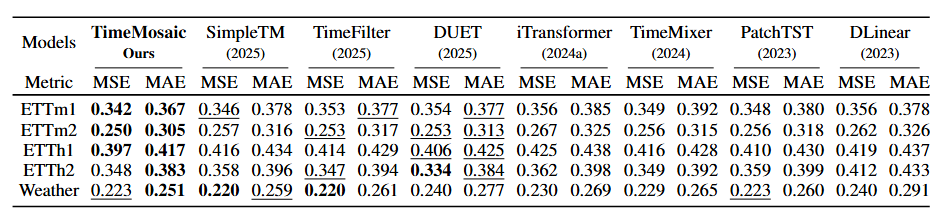
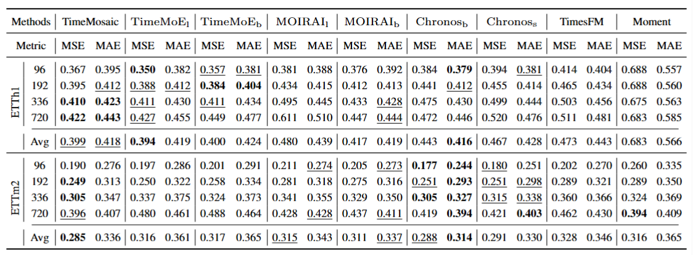

# TimeMosaic

[](https://arxiv.org/abs/2509.19406)
[](https://github.com/Day333/TimeMosaic/issues)
[](https://opensource.org/licenses/Apache-2.0)

**[<a href="https://mp.weixin.qq.com/s/OJSvOxwz9ZAKR5bqZ29-9g">中文解读1</a>]**
**[<a href="https://mp.weixin.qq.com/s/nFPQ8wL8jrIR_2WAwawpnQ">中文解读2</a>]**


> 📢 **Update (Nov 2025)**: Our paper *TimeMosaic: Information-Density Guided Time Series Forecasting via Adaptive Granularity Patch and Segment-wise Decoding* has been **accepted to AAAI 2026 (Main Track)** 🎉

This is the official implementation of our paper:  **TimeMosaic: Information-Density Guided Time Series Forecasting via Adaptive Granularity Patch and Segment-wise Decoding**


> This repository contains the official implementation of **TimeMosaic**, a novel framework for multivariate time series forecasting. It dynamically partitions input sequences into variable-length patches based on local temporal information density, and performs segment-wise forecasting through prompt-guided multi-task learning.


## Usage

1. Install Python 3.10. For convenience, execute the following command.

```
pip install torch==2.4.1 torchvision==0.19.1  --index-url https://download.pytorch.org/whl/cu121

pip install transformers==4.40.1 lightning==2.3.3 \
    gluonts==0.14.4 numpy==1.26.4 pandas==2.1.4 \
    -i https://pypi.tuna.tsinghua.edu.cn/simple
pip install scikit-learn -i https://pypi.tuna.tsinghua.edu.cn/simple
pip install reformer-pytorch -i https://pypi.tuna.tsinghua.edu.cn/simple
pip install -U "ml_dtypes==0.4.0" "jax[cpu]==0.4.28" "jaxtyping==0.2.28"
pip install -U "accelerate==0.31.0"
pip install transformers==4.40.1
```

2. Prepare Data. You can obtain the well pre-processed datasets from Time-Series-Library. [[Google Drive]](https://drive.google.com/file/d/1C89grm0nkDBMZZem4pj6TI8UpKtz9o7p/view?usp=sharing), Then place the downloaded data in the folder`./dataset`. Here is a summary of supported datasets.

Run the following commands from the BasicTS root directory to download BLAST from Hugging Face:

```
huggingface-cli download ZezhiShao/BLAST \
  --repo-type dataset \
  --local-dir ./dataset/BLAST
```
After the download finishes, the data will be under dataset/BLAST.  The weights of **TimeMosaic** trained on large-scale datasets can be accessed here: [Google Drive Link](https://drive.google.com/drive/folders/1xPb8em4Q6i-I7uMLlMJUP4p2UnlbuMxH?usp=sharing).


3. Train and evaluate model. We provide the experiment scripts for all benchmarks under the folder `./scripts/`. You can reproduce the experiment results as the following examples:
```bash
# Please comment the code for saving weights.
bash scripts/fair.sh
bash scripts/fair_x.sh
bash scripts/search.sh

# bash scripts/TimeMosaic/ETTh1.sh
```

## Result

Results under the hyperparameter search setting described in Paper Appendix Section I.

<div align="center">

</div>

Zero-shot forecasting results on two datasets.

<div align="center">

</div>

## Included Models

Our benchmark integrates over **20+ state-of-the-art time series forecasting models** spanning various design paradigms, including Transformer-based, MLP-based, and hybrid architectures. All models are implemented under a unified codebase with consistent settings to ensure fair and reproducible comparisons.

The following models have been included in our evaluation suite:

- ✅ **TimeMosaic** (Ours): A novel framework combining adaptive patch granularity and segment-wise prompt tuning.
- ✅ **SimpleTM** : SimpleTM: A Simple Baseline for Multivariate Time Series Forecasting [[ICLR 2025]](https://openreview.net/pdf?id=oANkBaVci5).
- ✅ **TimeFilter** : TimeFilter: Patch-Specific Spatial-Temporal Graph Filtration
for Time Series Forecasting [[ICML 2025]](https://arxiv.org/pdf/2501.13041v2).
- ✅ **xPatch** : xPatch: Dual-Stream Time Series Forecasting with Exponential Seasonal-Trend Decomposition [[AAAI 2025]](https://arxiv.org/pdf/2412.17323).
- ✅ **DUET** : DUET: Dual Clustering Enhanced Multivariate Time
Series Forecasting [[KDD 2025]](https://arxiv.org/pdf/2412.10859).
- ✅ **PathFormer** : Pathformer: Multi-scale Transformers with Adaptive Pathways for Time Series Forecasting [[ICLR 2024]](https://arxiv.org/pdf/2402.05956).
- ✅ **PatchMLP** : Unlocking the Power of Patch: Patch-Based MLP for Long-Term Time Series
Forecasting [[AAAI 2025]](https://arxiv.org/pdf/2405.13575).
- ✅ **iTransformer** : iTransformer: Inverted Transformers Are Effective for Time Series Forecasting [[ICLR 2024]](https://arxiv.org/pdf/2310.06625).
- ✅ **PatchTST** : A Time Series is Worth 64 Words: Long-term Forecasting with Transformers [[ICLR 2023]](https://arxiv.org/pdf/2211.14730).
- ✅ **TimesNet** : TimesNet: Temporal 2D-Variation Modeling for General Time Series Analysis [[ICLR 2023]](https://arxiv.org/pdf/2210.02186).
- ✅ **DLinear** : Are Transformers Effective for Time Series Forecasting? [[AAAI 2023]](https://arxiv.org/pdf/2205.13504).
- ✅ **TimeMixer** : TimeMixer: Decomposable Multiscale Mixing for Time Series Forecasting [[ICLR 2024]](https://openreview.net/pdf?id=7oLshfEIC2).
- ✅ **MICN** : MICN: Multi-scale Local and Global Context Modeling for Long-term Series Forecasting [[ICLR 2023]](https://openreview.net/pdf?id=zt53IDUR1U).
- ✅ **FreTS** : Frequency-domain MLPs are More Effective Learners in Time Series Forecasting [[NeurIPS 2023]](https://arxiv.org/pdf/2311.06184).
- ✅ **Crossformer** : Crossformer: Transformer Utilizing Cross-Dimension Dependency for Multivariate Time Series Forecasting [[ICLR 2023]](https://openreview.net/pdf?id=vSVLM2j9eie).
- ✅ **TiDE** : Long-term Forecasting with TiDE: Time-series Dense Encoder [[arXiv 2023]](https://arxiv.org/pdf/2304.08424.pdf).
- ✅ **LightTS** : Less Is More: Fast Multivariate Time Series Forecasting with Light Sampling-oriented MLP Structures [[arXiv 2022]](https://arxiv.org/pdf/2207.01186).
- ✅ **Autoformer** : Autoformer: Decomposition Transformers with
Auto-Correlation for Long-Term Series Forecasting [[NeurIPS 2021]](https://arxiv.org/pdf/2106.13008).
- ✅ **FEDformer** : FEDformer: Frequency Enhanced Decomposed Transformer for Long-term Series Forecasting [[ICML 2022]](https://arxiv.org/pdf/2201.12740).
- ✅ **Informer** : Informer: Beyond Efficient Transformer for Long Sequence Time-Series Forecasting [[AAAI 2021]](https://ojs.aaai.org/index.php/AAAI/article/view/17325/17132).
- ✅ **Pyraformer** : Pyraformer: Low-Complexity Pyramidal Attention for Long-Range Time Series Modeling and Forecasting [[ICLR 2022]](https://openreview.net/pdf?id=0EXmFzUn5I).
- ✅ **Reformer** : Reformer: The Efficient Transformer [[ICLR 2020]](https://arxiv.org/pdf/2001.04451).
- ✅ **ETSformer** : ETSformer: Exponential Smoothing Transformers for Time-series Forecasting [[arXiv 2022]](https://arxiv.org/pdf/2202.01381).


All models are trained under identical lookback lengths and evaluation metrics (MSE/MAE), and the same `drop_last=False` setting to ensure fairness and reproducibility.

# Citation
If you find our work helpful, please consider citing us:

```bibtex
@article{ding2025mosaic,
  title={TimeMosaic: Temporal Heterogeneity Guided Time Series Forecasting via Adaptive Granularity Patch and Segment-wise Decoding}, 
  author={Kuiye Ding and Fanda Fan and Chunyi Hou and Zheya Wang and Lei Wang and Zhengxin Yang and Jianfeng Zhan},
  journal={arXiv preprint arXiv:2509.19406},
  year={2025}
}
```

## Acknowledgements

We appreciate the following resources a lot for their valuable code and datasets:

- Time-Series-Library (https://github.com/thuml/Time-Series-Library)
- iTransformer (https://github.com/thuml/iTransformer)
- BasicTS (https://github.com/GestaltCogTeam/BasicTS)
- TFB (https://github.com/decisionintelligence/TFB)
